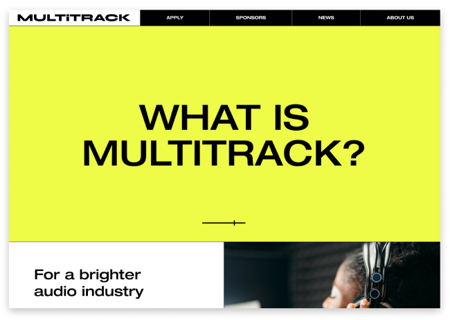

# Multitrack Website

## Introduction

Multitrack is a charity that works with artists and producers by providing fellowships and work placements for underrepresented people in the audio industry.
The UI was provided and created by Catarina Coelho(https://catarinacoelho.pt/). I really liked the design aesthetic so I used it as a way to practice my React and CSS skills.
Most of the information and assets like photographs were pulled from [Multitrack’s official website](https://www.multitrack.uk/).

## Stack

- Vite
- React
- Emailjs
- Firebase

## Deployment

Deployed with Github Pages. You can take a look at the [website here](https://joaodmonteiro.github.io/multitrack).

## What I learned?

This was the first time I was using some of these technologies, so I learned a bunch from this project.
One of them was React, which was probably one of the first buzzwords I learned about when I started learning web development. And now I understand why! It made me learn a lot about javascript and how a project can/should be structured. I absolutely love it. The way it promotes the reusability of modules and how clean and tidy my code looks compared to my vanillaJS projects makes for a better coding experience.
I also got to practice a lot with CSS, especially making a lot of use of CSS grid and Flexbox. CSS can definitely be frustrating at times and there were definitely some moments when I started questioning my ability to center divs but I got through it. I learned how much of a difference it makes to really think about how the HTML structure is going to be before starting to code.
Setting up variables for font sizes and colours is also a good way to make a cohesive layout.
Even though basically all of the design was already done I got to experiment a bit with Adobe XD which taught me not only some technical design skills but also about the relationship between the designer and the developer and how to make sure that assets are properly set up.

## Technologies

### Vite

Development server and bundling for production.

Why not webpack?

In part, this was just me trying out vite, since I had only been using webpack until then. But I quickly came to realise how much of a difference ES modules in the browser make. It improves the speed at which the development server updates by a lot, making tweaking CSS values and that sort of thing feel much better.

### React

The frontend framework

I used create-react-app which is built into Vite to create my project. I then did my best to separate the file structure into components, pages and hooks and took advantage of react-router-dom for setting up links for the different pages.

### EmailJS

EmailJS is a javascript library and a product that enables you to send emails directly from client-side javascript code.

I decided to use it for the contact form as it was an easy way to implement the ability for the user to send an email without using ‘mailto:’ links which I personally always found a bit inconvenient especially if you don’t use mail apps.

### Firebase

I wanted to make this project and bit more than just a simple static website and also wanted to make it possible for the client (the Multitrack team) to easily update the website with new articles.

There are definitely other routes I could’ve taken with this by using a headless CMS for example but I think firebase does the job well.

I am using Firestore for the text content as well as Cloud Storage for the images.

## What I would do differently

- **Git**: Since this was a project I developed by myself, I didn't feel the obligation to make the cleanest commits with the best messages I could. This is definitely an area in which I need to improve on and will make sure I focus on the next projects. I also want to learn about specific git workflows and try them out as if I was part of a team of developers.
- **CSS**: Even though I made use of variables for my CSS files, I feel like I spent too much time doing small tweaks in the values of padding, margins, font sizes, etc. And I feel like I could have properly set up all of my design rules in the beginning.
- **Backend**: Even though I’m happy with how the current setup works, I feel like the ideal way for the backend of the site would be to use a headless CMS like Strapi and have that on a server deployed somewhere like Heroku. Strapi just provides an easier interface for creating content compared to Firebase.
  Another way I could’ve gone with and which I still might add to the website is an admin page with a friendly UI to create news articles. That way I still would be using Firebase for the database but the upload of the articles and images would be done through the website.

